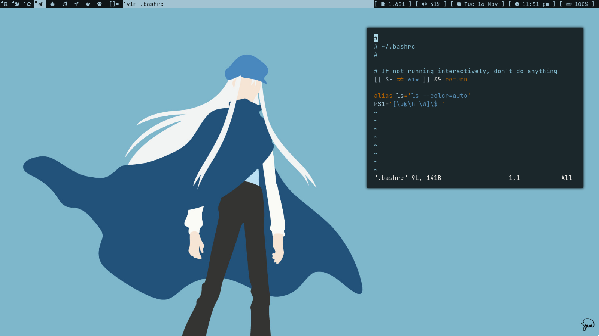

# Arch Linux Magic

| Screenshot 1 | Screenshot 2|
|---|---|
| |  |

### Step 1
```sh
curl -LO git.io/arch-linux-magic
```

### Step 2
```sh
mv arch-linux-magic arch_install.sh
```

### Step 3
```sh
bash arch_install.sh
```

`
Note: You must create two partitions, 
one for boot about 512MB and one for root
`

<hr>

#### Warning 
```
This script only works on physical machines, don't try to use it in VMs
```
